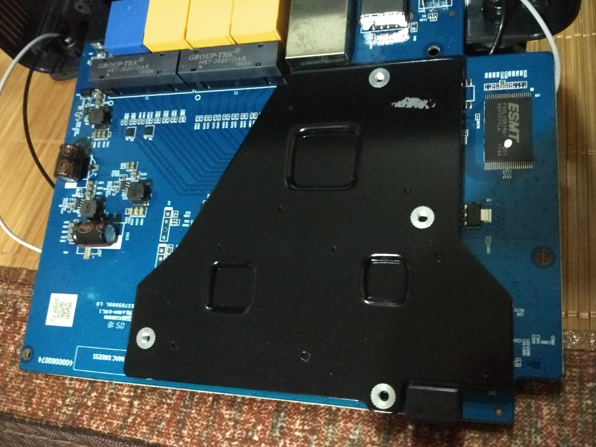

# 极路由最后的产品

因为一直在用极路由，加了一个极路由的官方群一直潜水，6月底的时候，斐讯开始暴雷，连带着极路由，官方群里也禁言了。

到7月28号，才有管理员解除了禁言。

买之前也没搜评测，买了之后才搜到两篇文章。
[[众测报告] 徒有其表还是金玉其中？极路由4拆解](http://bbs.zhiyoo.com/thread-12817819-1-1.html)

[极路由4增强版值得买吗？极路由4增强版拆解全面评测](https://www.jb51.net/network/545919.html)

> 下面四张图片均出自上方的拆解文章。

> 下面这张出自官方的宝贝描述，注意文字描述的第二行文字。

脚垫和散热片的做工，确实都很好，特别是这么厚的散热片还有鳍片。加上宝贝的描述1200M无线。
但是实际呢，当你拿到说明书后，参数上写着如下：

明白了把，是2.4GWiFi的**300Mbps**和5G的WiFi**867Mbps**加起来1200Mbps，这样算全千兆路由器么？而且只在宝贝的说明里轻描淡写的说了一句**2.4GHz和5GHz双频并举，可使无线传输速率高达1200Mbps**，问题是哪个设备能够同时连接2.4G和5G的WiFi呢？
看看宝贝页面的参数详情页，京东上也是一样。

这个是第一个看到极路由耍小聪明的地方，十分无语。

然后是散热片，我拿到手后，用手电从侧面的格栅里看，没有看到有上面宣传图中的鳍片和突起的螺钉。然后问客服，第一个客服敷衍着说帮我问问，然后就没有消息了，晚上再问，有没有问道，另外一个客服直接说没看过拆机图，不知道散热片的事情，发热是正常的，不满意可以7天无理由退货。

好吧， 那我就自己拆把，先是没有三角形2.3毫米的螺丝，等着螺丝刀来的路上先用了几天，测试了下网速的情况。
内网有线的千兆到867Mbps无线，速度图如下。

基本上最快速度在45M/s左右。当然了，这是隔着很近测的。千兆无线就没有测了。
信号什么算说的过去，家里的电视机顶盒也不会跟1s一样连2.4Ghz的WiFi卡顿了。总体来说。还算满意。

## 拆机

然后是工具到了。先是脚垫，比最早的媒体拆解图就不一样了，少了凸起来的一部分。

然后，PCB版的另外的右边，靠近电源接口的地方。

后来反过来看到正面的位置是两个普通的电解电容，看这情况，应该是手工拆开过返修的。左上角还空了两个焊位，对比文章最上面两个拆机的链接是把固定WiFi天线的座子省掉了。另一次也同样省掉了。而且螺丝也一样了，中间多几个固定螺丝。
然后是正面：

注意左边的两个平放的电容，还有三黄一篮的网络接口的下面两个长条形的。我们来与早期的拆机图对比。

看出差别了么，两颗固态电容换成了普通的电解电容。网络变压器换由TNK 1618C7 QT48A03芯片换成了别的型号，图片当时拆机的时候没有拍清楚。拆的时候没想着对比，只想看散热片是不是没有。
对的，我之前就没有看错，连散热片都换掉了！!

由原来的有鳍片的散热片换成了光秃秃的扁平铁片！！！虽然大了一点把右下角包裹住了，但是没有鳍片，这表面积一增一减。
而且这个角度正好拍到了网络变压器被更改后的型号，换成了GROUP-TEK品牌的HST-36201DAR。

下面是散热硅脂片的对比。

上面是第一个链接的拆机图，第二个链接也是一样的。

而且屏蔽罩中也没有框架。

## 总结

- 宣传文案上故意隐瞒无线最高只有867Mbps的事实
- 脚垫和散热片缩水（肉眼可见）
- 屏蔽罩框架缺失
- 升压模块的电容由固态电容缩水成电解电容
- 网络变压器芯片型号变更（都是国内的品牌，我手上的型号官网上也查不到，天眼查两个公司的注册资本TNK是1500W，GROUP-TEK是500W，具体有没有缩水不好判断）

说实话，没有对比以前，我以为只有散热片缩水比较严重，文章边写边对比，写到这里，心情十分复杂。我是在7月28号下的单，可能是真的为了我心里可笑的情怀把。只是为了在大学寝室里的回忆，和第一次拿到可以装插件的路由器的开心的记忆。